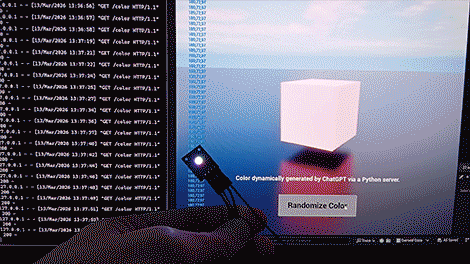
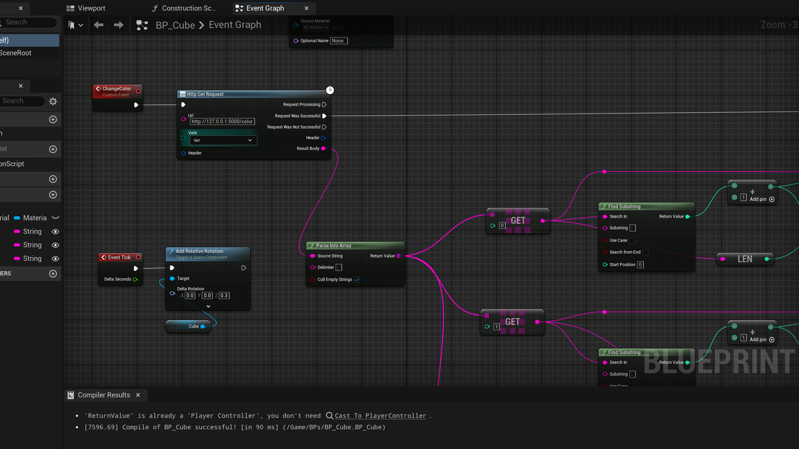
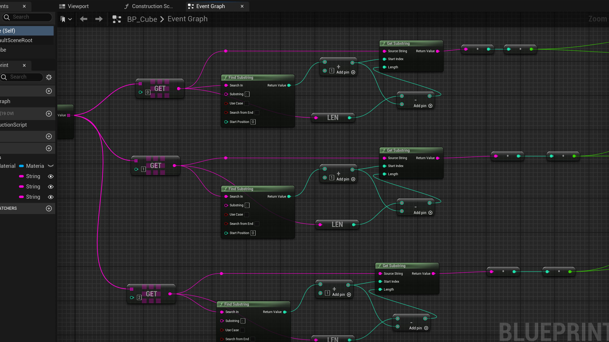
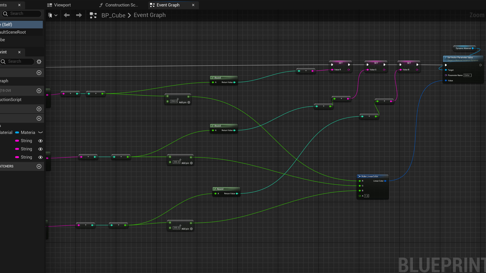
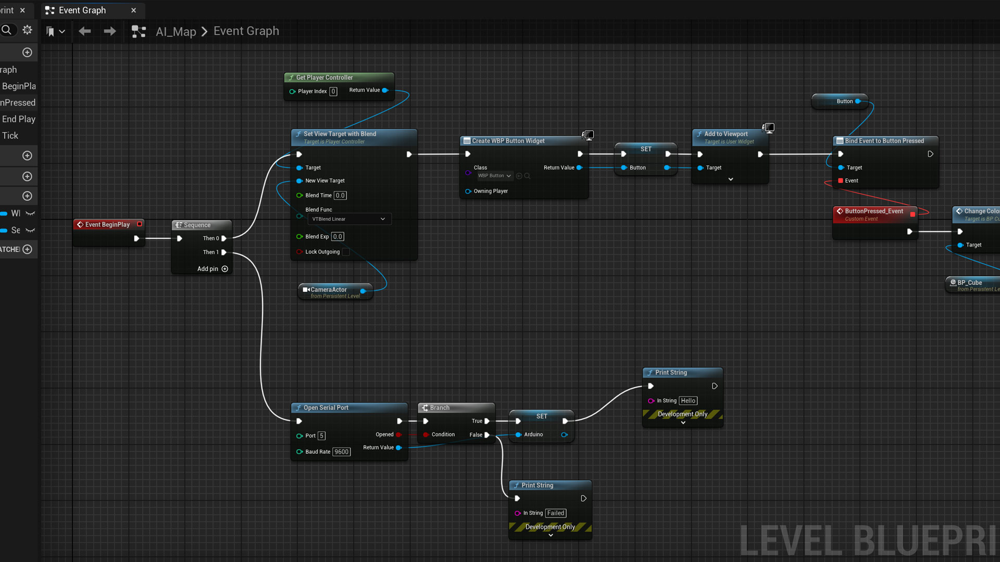
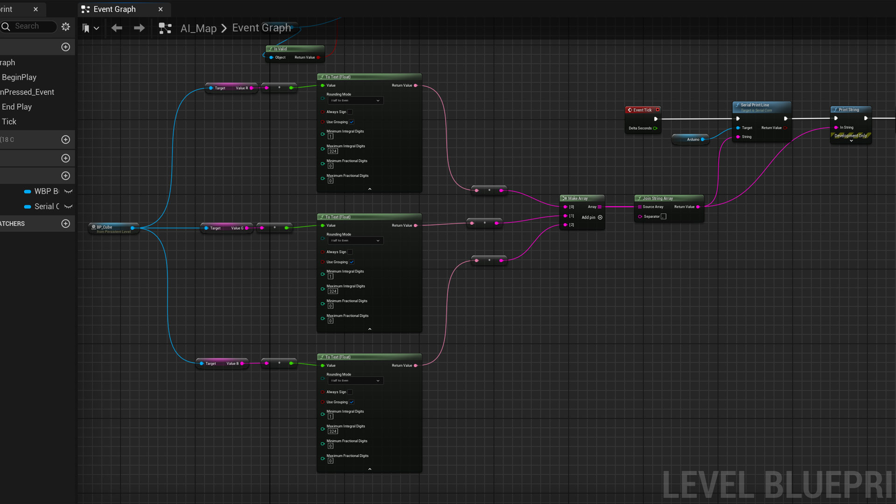
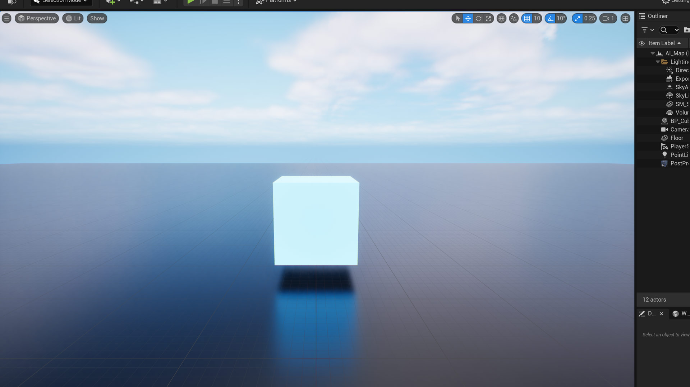

You must create two new files in the system. The first is a Python server that generates random colors.

from flask import Flask, jsonify
import random

app = Flask(__name__)

@app.route("/")
def home():
    return "Color Server Running. Use /color"

@app.route("/color")
def get_color():
    r = random.randint(0,255)
    g = random.randint(0,255)
    b = random.randint(0,255)

return jsonify({
        "r": r,
        "g": g,
        "b": b
})

if __name__ == "__main__":
    app.run(host="127.0.0.1", port=5000)

The second file is a .env file that stores environment variables such as the OpenAI API key.

OPENAI_API_KEY=your_api_key_here

The rest of the system runs inside Unreal Engine.

The HTTP request is triggered from an Actor Blueprint. The returned JSON values are split into RGB channels, converted into a Linear Color, and used to drive a vector parameter on a material instance applied to a static mesh. A widget created in the Level Blueprint provides a button that sends the same RGB values to the Arduino via Serial.println() in the format R,G,B, allowing the physical LED to mirror the color generated in Unreal.

